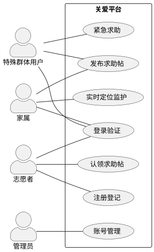
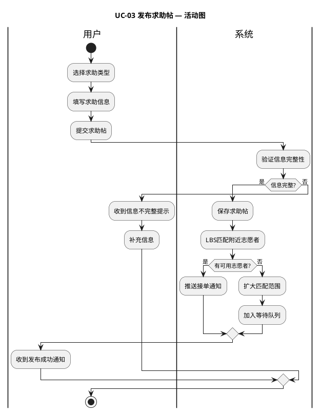
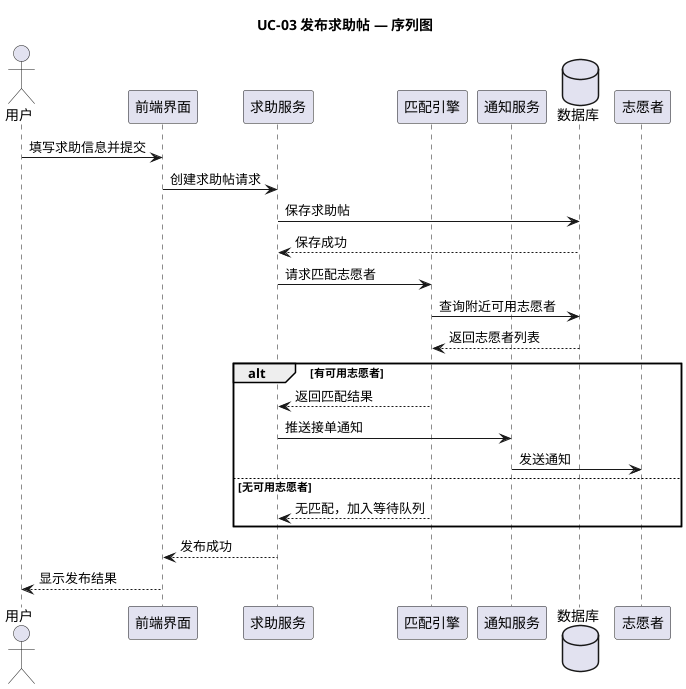
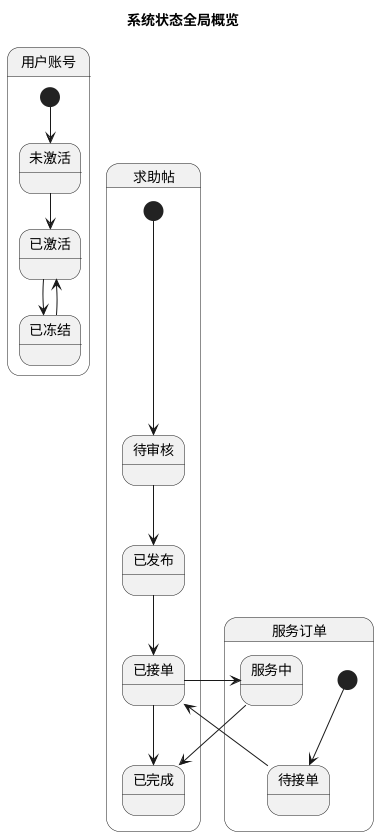
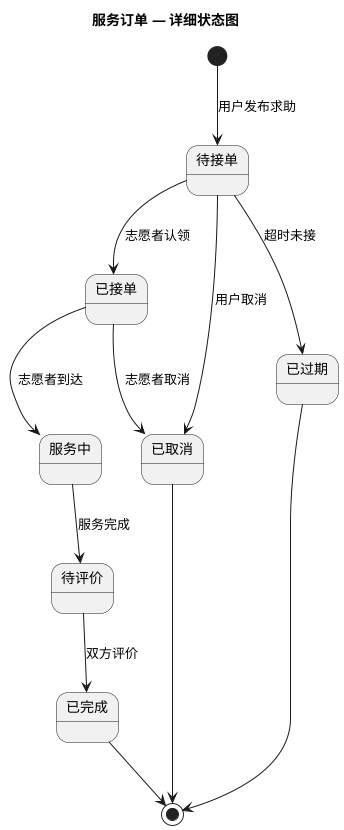
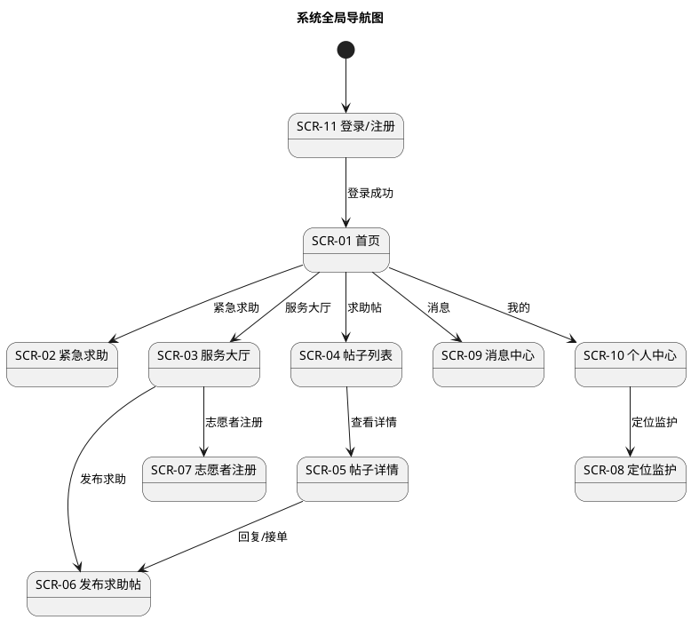
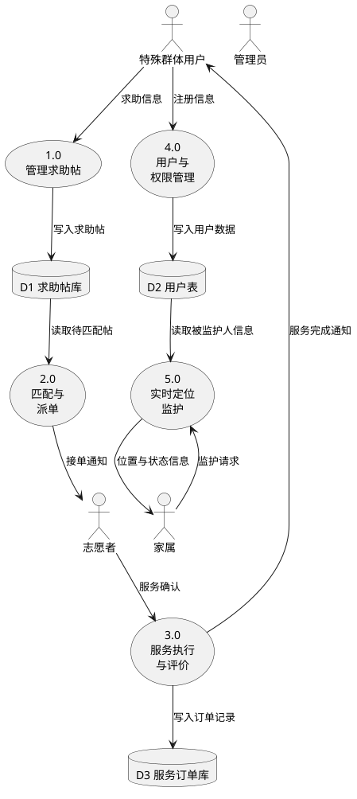
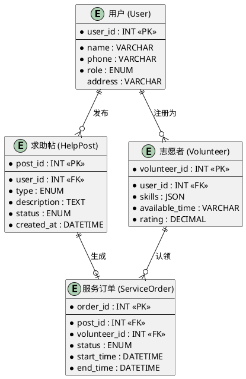

# /model-requirements

从愿景与范围文档出发，一次性产出完整的需求建模 Markdown 文档。覆盖功能、行为、数据三类模型，每个用例配套独立的活动图和序列图，状态模型和会话图均先给出系统全局概览再展开细节，每种图形模型使用 PlantUML 生成图片并嵌入文档。

## 调用方式

```text
/model-requirements ChemTrack 化学试剂库存管理系统
/model-requirements 社区老弱病残孕智慧关爱互助平台
```

如果项目已有愿景与范围文档，可直接指定文件路径：

```text
/model-requirements vision-and-scope.md
```

## 前置条件

需要本地安装 PlantUML（`brew install plantuml`）。命令执行时会自动调用 `plantuml` CLI 将 `.puml` 文件渲染为 PNG 图片。

## 输出结构

命令在项目目录下创建以下文件结构：

```
requirements-modeling/
├── README.md                  # 主文档，引用下方所有图片
├── diagrams/
│   ├── use-case-diagram.puml  # 用例图 PlantUML 源码
│   ├── use-case-diagram.png   # 用例图（渲染后）
│   ├── activity-UCxx.puml     # 每个用例的活动图源码
│   ├── activity-UCxx.png      # 每个用例的活动图（渲染后）
│   ├── sequence-UCxx.puml     # 每个用例的序列图源码
│   ├── sequence-UCxx.png      # 每个用例的序列图（渲染后）
│   ├── state-overview.puml    # 系统状态全局概览图源码
│   ├── state-overview.png     # 系统状态全局概览图（渲染后）
│   ├── state-XXX.puml         # 每个对象的详细状态图源码
│   ├── state-XXX.png          # 每个对象的详细状态图（渲染后）
│   ├── dialog-overview.puml   # 系统全局导航图源码
│   ├── dialog-overview.png    # 系统全局导航图（渲染后）
│   ├── dialog-XXX.puml        # 每个用例的会话图源码
│   ├── dialog-XXX.png         # 每个用例的会话图（渲染后）
│   ├── dfd-level0.puml        # Level 0 数据流图源码
│   ├── dfd-level0.png         # Level 0 数据流图（渲染后）
│   ├── dfd-level1-XXX.puml    # Level 1 数据流图源码（按过程）
│   ├── dfd-level1-XXX.png     # Level 1 数据流图（渲染后）
│   ├── erd.puml               # ER 图源码
│   └── erd.png                # ER 图（渲染后）
```

主文档 `README.md` 通过 `` 引用图片。

## 工作流

### 步骤 1：功能模型 — 用例建模（use-case）

1. 从愿景与范围文档的特性列表（FE-x）出发，识别所有参与者（Actor）和用例。
2. 使用 `use-case` 技能，为每个用例编写完整的用例描述，包含 7 个要素：
   - 用例名称与编号（UC-xx）
   - 简要描述
   - 前置条件
   - 事件流（基本流 + 异常流，异常流用分支编号如 3a、5b）
   - 后置条件
   - 约束说明（交叉引用 FE-x、BO-x、LI-x 等编号）
3. 生成 PlantUML 用例图并渲染为 PNG：



将 `.puml` 写入 `diagrams/use-case-diagram.puml`，执行 `plantuml diagrams/use-case-diagram.puml` 生成 PNG。在 README.md 中插入：

```markdown

```

### 步骤 2：行为模型 — 活动图与序列图（process-modeling）

**为步骤 1 中的每个用例分别创建一张活动图和一张序列图。**

1. 遍历步骤 1 产出的用例列表，为**每个用例**（UC-xx）创建：
   - **一张泳道活动图**（activity-UCxx）：展示该用例的完整事件流（含异常流分支），使用泳道区分参与者和系统。
   - **一张序列图**（sequence-UCxx）：展示该用例中参与者与系统各模块之间的消息交互时序。
2. 使用 `process-modeling` 技能，标注决策点、并行路径和跨职能交接点。
3. 每张图单独一个 `.puml` 文件，文件名包含用例编号。

**活动图示例（每个用例一张）：**



**序列图示例（每个用例一张）：**



### 步骤 3：行为模型 — 状态建模（state-modeling）

**先创建系统级全局状态概览图，再为每个关键对象创建详细状态图。**

1. **系统全局状态概览图**：创建一张总览图，展示系统中所有关键领域对象及其主要状态的全貌，帮助读者快速理解系统整体的状态空间。



2. **逐个对象的详细状态图**：识别具有生命周期的关键领域对象（如订单、工单、用户账号、求助帖），使用 `state-modeling` 技能为每个对象创建：
   - 状态列表（初始态、正常态、异常态、终止态）
   - 事件/触发器列表
   - 状态转换表（状态×事件矩阵，审查每个空单元格）
   - 详细状态转换图



### 步骤 4：行为模型 — 决策表（decision-table）

1. 从用例事件流中识别包含复杂条件逻辑的场景（多条件分支、权限判断、匹配规则等）。
2. 使用 `decision-table` 技能，为每个复杂场景创建决策表。
3. 验证完备性：二值条件应覆盖 2^N 条规则。
4. 决策表以 Markdown 表格形式直接写入文档（无需生成图片）。

### 步骤 5：行为模型 — 会话图（dialog-map）

**先创建系统级全局导航图，再为每个核心用例创建详细会话图。**

1. **系统全局导航图**：创建一张总览图，展示系统所有主要界面和它们之间的导航关系全貌，帮助读者快速理解系统的整体 UI 结构。



2. **屏幕清单与导航路径**：基于用例事件流，使用 `dialog-map` 技能建立：
   - 屏幕/界面清单表（SCR-ID、名称、用途、关联用例、访问角色）
   - 导航路径表（源界面、触发动作、守卫条件、目标界面）
   - 用例步骤 → 屏幕映射表

3. **逐个用例的详细会话图**：为每个核心用例的 UI 流程生成 PlantUML 会话图：

```plantuml
@startuml dialog-claim-post
(*) --> "首页"
"首页" --> "帖子列表" : 认领求助帖
"首页" <-- "帖子列表" : 返回

"帖子列表" --> "帖子详情" : 选择帖子
"帖子详情" --> "申请界面" : 发起申请
"帖子详情" --> "私信页面" : 私信地址
"帖子详情" <-- "私信页面" : 返回

"申请界面" --> "确认页" : 确认信息
"申请界面" --> "帖子详情" : 取消

"确认页" --> "成功提示" : 确认成功
"确认页" --> "申请界面" : 修改意见
"成功提示" --> (*)
@enduml
```

### 步骤 6：数据模型 — 数据流图（data-flow-diagram）

1. 从上下文图或用例列表出发，识别系统内部 3-7 个主要过程和数据存储。
2. 使用 `data-flow-diagram` 技能，绘制 Level 0 DFD，展示过程、数据存储和外部实体之间的数据流。
3. 验证平衡性：上下文图（如果有）中的每条外部数据流在 Level 0 中均有对应。
4. 对最复杂的过程进行 Level 1 分解。
5. 生成 PlantUML 图：



### 步骤 7：数据模型 — ER 图（data-modeling）

1. 从用例描述中提取所有数据实体、属性和关系。
2. 使用 `data-modeling` 技能，为每个实体定义：
   - 实体描述和主键
   - 属性表（属性名、类型、是否必填、描述）
3. 定义实体间关系（动词短语、基数 1:1/1:N/M:N、参与约束）。
4. 生成 PlantUML ER 图：



### 步骤 8：渲染图片与组装文档

1. 将所有 `.puml` 文件写入 `requirements-modeling/diagrams/` 目录。
2. 执行批量渲染：
   ```bash
   plantuml -tpng requirements-modeling/diagrams/*.puml
   ```
3. 组装 `requirements-modeling/README.md`，结构如下：
   - `# 需求建模文档：[项目名称]`
   - `## 1. 功能模型` — 用例描述 + ``
   - `## 2. 行为模型`
     - `### 2.1 活动图与序列图` — 按用例编号逐个展示：
       - `#### UC-01 xxx` — 用例简述 + `` + ``
       - `#### UC-02 xxx` — 同上
       - ……
     - `### 2.2 状态模型` — 系统全局概览图 + 各对象的详细状态表和状态图：
       - ``
       - `#### 服务订单状态` — 状态表 + ``
       - ……
     - `### 2.3 决策表` — Markdown 表格
     - `### 2.4 会话图` — 系统全局导航图 + 屏幕清单 + 各用例的详细会话图：
       - ``
       - `#### UC-03 xxx 会话图` — ``
       - ……
   - `## 3. 数据模型`
     - `### 3.1 数据流图` — Level 0 DFD + 数据流表 + Level 1 分解（如有）：
       - ``
       - `#### Level 1：xxx` — ``
     - `### 3.2 ER 图` — 实体属性表 + ``
   - `## 4. 模型交叉验证报告`

## 检查点

完成全部步骤后，执行以下交叉验证：

- **特性覆盖**：每个 FE-x 特性至少被一个用例（UC-xx）覆盖
- **屏幕覆盖**：每个用例的每个步骤可映射到会话图中的一个屏幕
- **数据覆盖**：ER 图中的每个实体至少在一个用例中被引用
- **DFD 平衡**：DFD Level 0 中的外部数据流与上下文图（或用例列表）一致；DFD 数据存储与 ER 图实体对应
- **状态追溯**：状态图中的每个状态转换可追溯到用例事件流中的一个动作
- **一致性**：用例中提及的数据在 ER 图中有对应实体，用例中的界面操作在会话图中有对应屏幕
- **图片完整**：所有 `.puml` 文件均已渲染为 `.png`，Markdown 中的图片引用均可正常显示
- 将验证结果输出为模型交叉验证报告

## 后续步骤

- 运行 `/write-srs` 将建模结果转化为正式的软件需求规格说明书。
- 运行 `/validate` 对模型和需求进行评审验证。
- 如果建模过程中发现了需求空白，运行 `/elicit` 补充需求获取。
