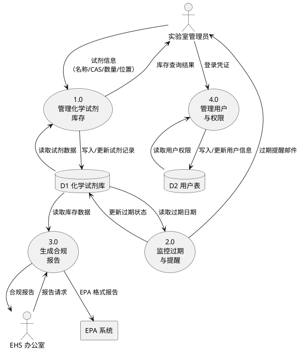
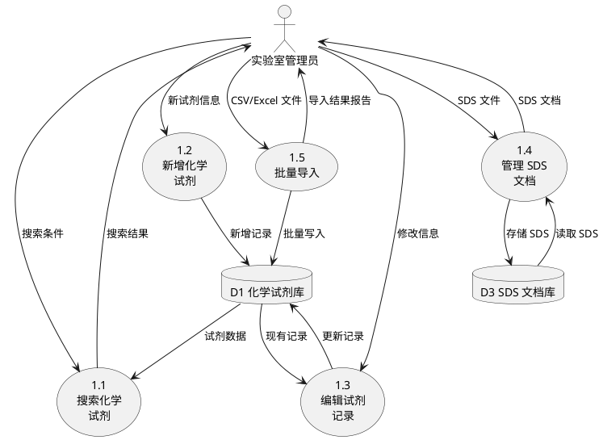

## 目的

从上下文图（DFD 最顶层）出发，将系统内部分解为过程、数据存储和数据流，形成 Level 0 和 Level 1 数据流图。DFD 展示系统内部"做什么"而非"怎么做"——关注数据的转换和流动，而非实现细节。

上下文图将系统视为一个黑盒（参见 `skills/context-diagram/SKILL.md`）。本技能打开这个黑盒，展示内部结构。

## 关键概念

### DFD 元素

| 元素 | 符号 | 描述 | 编号约定 |
|------|------|------|----------|
| 过程（Process） | 圆角矩形/圆形 | 将输入数据转换为输出数据的处理 | Level 0: 1.0, 2.0, 3.0 / Level 1: 1.1, 1.2, 1.3 |
| 数据存储（Data Store） | 双横线（开放矩形） | 系统内部存储的数据集合 | D1, D2, D3 |
| 外部实体（External Entity） | 矩形 | 系统边界外的参与者或系统（从上下文图继承） | E1, E2, E3 |
| 数据流（Data Flow） | 带标签的箭头 | 数据在元素之间的传递 | 用数据内容命名 |

### DFD 层级体系

```
上下文图（Context Diagram）
  └── Level 0 DFD：将"系统"气泡分解为 3-7 个主要过程 + 数据存储
        └── Level 1 DFD：将某个 Level 0 过程进一步分解为子过程
              └── Level 2+ DFD：继续分解（通常不超过 Level 2）
```

### 平衡规则

**上下文图与 Level 0 之间必须平衡：** 上下文图中进出系统的每条数据流，必须在 Level 0 DFD 中作为外部实体与某个过程之间的数据流出现。不能多也不能少。

同理，Level 0 中某个过程的所有输入输出，在其 Level 1 分解中必须完整体现。

### 分层分解原则

- **7±2 规则**：每层 DFD 的过程数量控制在 3-7 个
- **何时停止分解**：当一个过程可以用一段简短的文字描述清楚（约 1 页以内），就不需要继续分解
- **数据存储出现规则**：数据存储只在首次被读写的层级出现，下层继承

### 从 DFD 导出需求

| DFD 元素 | 导出的需求类型 |
|----------|---------------|
| 过程 | 功能需求：该过程执行的数据转换逻辑 |
| 数据存储 | 数据需求：存储的数据结构、容量、保留策略 |
| 输入数据流 | 输入验证需求：数据格式、校验规则 |
| 输出数据流 | 输出需求：数据内容、格式、频率、目标 |
| 过程间数据流 | 接口需求：内部模块间的数据交互 |

### 反模式

- **实现偏差**：DFD 画成了系统架构图或模块调用图。DFD 描述"做什么"不是"怎么做"。
- **控制流混入**：箭头表示的是"控制信号"或"调用关系"而非数据。DFD 只有数据流，没有控制流。
- **数据存储缺失**：所有数据都在过程之间直接传递，没有数据存储。真实系统几乎总有持久化数据。

## 应用

### 步骤 1：从上下文图出发

以上下文图为起点（参见 `skills/context-diagram/SKILL.md`）。列出：
- 所有外部实体（E1, E2, ...）
- 所有进出系统的数据流

如果没有上下文图，从用例列表和愿景与范围文档推导外部实体和数据流。

### 步骤 2：识别主要过程

从系统的核心功能出发，识别 3-7 个主要过程。识别方法：
- 从用例列表中归类——多个相关用例可以合并为一个过程
- 从特性列表（FE-x）出发——每个高优先级特性通常对应 1-2 个过程
- 从数据转换角度——思考系统对输入数据做了哪些根本性的转换

为每个过程分配编号（1.0, 2.0, ...）和动宾短语命名（如"管理库存"、"生成报告"）。

### 步骤 3：识别内部数据存储

扫描所有过程，识别需要持久化的数据：
- 一个过程产生、另一个过程消费的数据 → 需要数据存储
- 需要跨会话保留的数据 → 需要数据存储
- 对应 ER 图中的实体 → 通常对应一个数据存储

为每个数据存储分配编号（D1, D2, ...）和名词命名（如"化学试剂库"、"用户表"）。

### 步骤 4：绘制 Level 0 DFD 并验证平衡

1. 放置所有外部实体（从上下文图继承）
2. 放置所有过程和数据存储
3. 绘制数据流箭头，每条数据流用具体的数据内容命名
4. **验证平衡**：逐条检查上下文图中的数据流，确认每条都在 Level 0 中出现

**平衡验证表：**

| 上下文图数据流 | 方向 | Level 0 中的对应 | 是否平衡 |
|---------------|------|-----------------|----------|
| [数据流名] | 输入/输出 | [外部实体] → [过程] | 是/否 |

生成 PlantUML 图：



### 步骤 5：按需分解到 Level 1

选择最复杂的过程（通常是包含最多子功能的过程），将其分解为 3-5 个子过程。

**分解示例（1.0 管理化学试剂库存 → Level 1）：**



**平衡验证**：Level 0 中过程 1.0 的所有输入输出（试剂信息输入、库存查询结果输出、D1 读写），在 Level 1 中必须全部体现。

## 示例

参见 `examples/sample.md` 中的 ChemTrack 数据流图完整范例。

## 常见陷阱

### 陷阱 1：平衡违规
**症状：** Level 0 DFD 中出现了上下文图中没有的外部数据流，或遗漏了某些数据流。
**后果：** 系统边界不清晰，可能遗漏需求或引入范围外功能。
**修复：** 逐条对照上下文图数据流，填写平衡验证表，补齐缺失项。

### 陷阱 2：过程命名不当
**症状：** 过程命名为名词（"库存"）或模糊动词（"处理数据"），而非具体的动宾短语。
**后果：** 无法明确该过程的职责，不同人理解不一致。
**修复：** 使用"动词+宾语"命名：管理库存、生成报告、验证权限。

### 陷阱 3：缺少数据存储
**症状：** 所有数据都在过程之间直接传递，没有数据存储。
**后果：** 忽略了数据持久化需求，遗漏数据结构和存储相关的需求。
**修复：** 检查每个过程间数据流：如果数据需要跨会话或跨过程复用，就需要数据存储。

### 陷阱 4：过度分解
**症状：** Level 0 有超过 7 个过程，或 Level 1 分解了所有过程（包括简单过程）。
**后果：** 图形过于复杂，失去全局视角，难以评审。
**修复：** Level 0 控制在 3-7 个过程；只对复杂过程做 Level 1 分解；简单过程用文字描述即可。

### 陷阱 5：混淆数据流与控制流
**症状：** 箭头标注为"调用"、"触发"、"启动"等控制指令。
**后果：** DFD 变成了系统架构图或流程图，失去数据视角的分析价值。
**修复：** 箭头只标注数据内容（名词或名词短语）。控制逻辑用活动图或序列图表达。

## 参考

### 相关技能
- `skills/context-diagram/SKILL.md` — DFD 的最顶层（上下文图），是本技能的前置输入
- `skills/data-dictionary/SKILL.md` — 为 DFD 中的数据流和数据存储提供精确定义
- `skills/data-modeling/SKILL.md` — ER 图与数据存储互为补充：ER 图描述数据结构，DFD 描述数据流动
- `skills/process-modeling/SKILL.md` — 活动图关注控制流和决策，DFD 关注数据流，二者互补

### 外部框架
- Tom DeMarco, *Structured Analysis and System Specification* (1979) — DFD 方法论的奠基之作
- Karl Wiegers & Joy Beatty, *Software Requirements, Third Edition*, Chapter 12 — 数据流图在需求分析中的应用

---

**技能类型：** Component
**依赖：** context-diagram（上下文图作为 Level 0 分解的输入）
**被使用于：** requirements-analysis-process, model-requirements 命令
